# Pravah

Pravah is an innovative mobile application designed to revolutionize rural development through AI-powered resource allocation and sustainable energy management. The app leverages Google's Gemini AI to provide intelligent recommendations for renewable energy adoption, optimize resource utilization, and promote sustainable practices in rural communities.

Through its intuitive interface, Pravah offers real-time data analytics, location-based energy predictions, and sustainable waste management solutions. The integration of Google's Gemma and Gemini AI enables precise predictions for renewable energy potential and provides personalized sustainability guidance, making it an essential tool for rural communities to embrace clean energy alternatives.

Built with Flutter for cross-platform functionality, Firebase for robust backend services, and Gemini AI for intelligent analysis, Pravah provides an intuitive platform for rural communities to embrace sustainable development and contribute to environmental conservation.

## Features

- **AI-Powered Energy Prediction**: Uses Gemma to predict optimal renewable energy sources (solar, wind) based on location-specific data
- **Real-Time Energy Monitoring**: Tracks daily energy generation, savings, and carbon footprint reduction
- **Sustainable Waste Management**: AI-driven image
  analysis for customized waste processing suggestions.
- **Location-Based Analysis**: Recommends best-suited renewable energy sources for specific areas.
- **AI Chatbot**: Personalized sustainability guidance and support for rural communities.

## Tech Stack

| Technology      | Description                                   |
| --------------- | --------------------------------------------- |
| Flutter         | Cross-platform mobile application development |
| Firebase        | Authentication and data management            |
| Gemma AI        | Location-based energy prediction              |
| Gemini AI       | Chatbot and waste management solutions        |
| Google Maps API | Location services and geospatial analysis     |
| OpenWeather API | Real-time weather data for energy predictions |

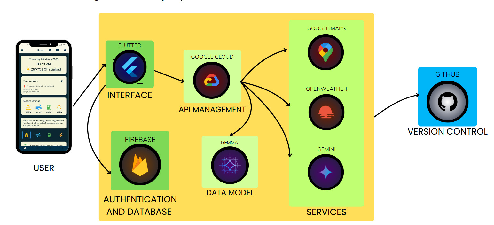

## App Screenshots

<p float="left">
  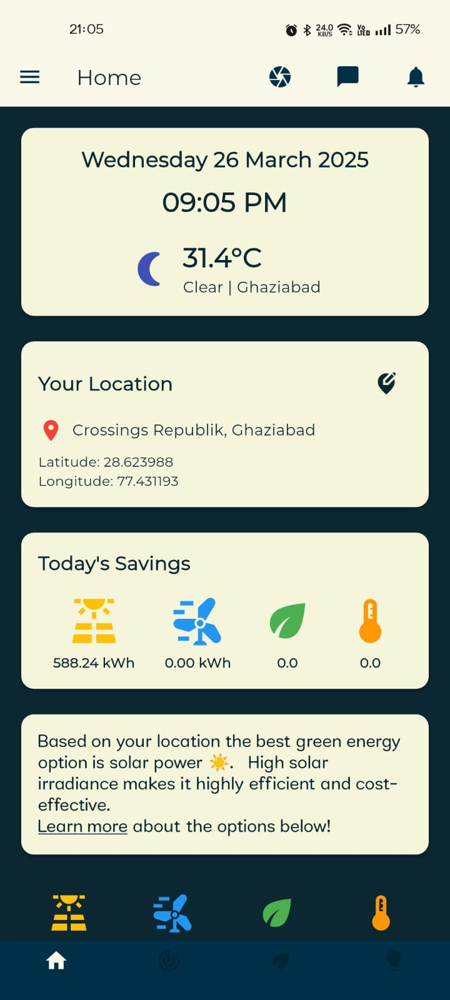
  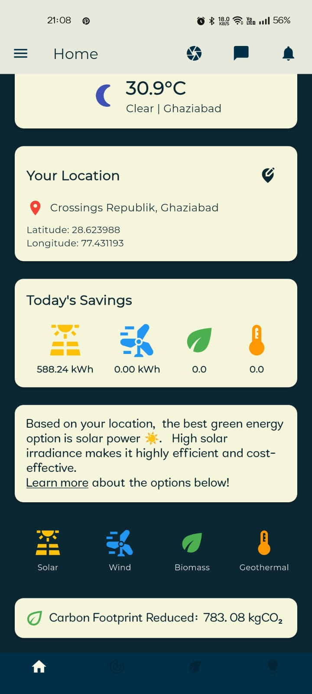 
  
  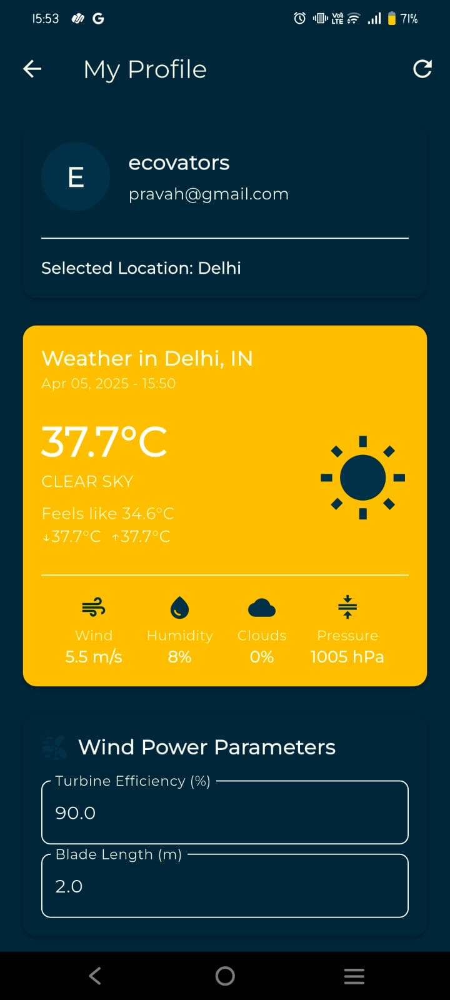
</p>

<p float="left">
  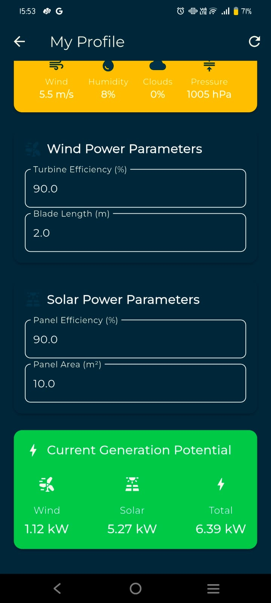
  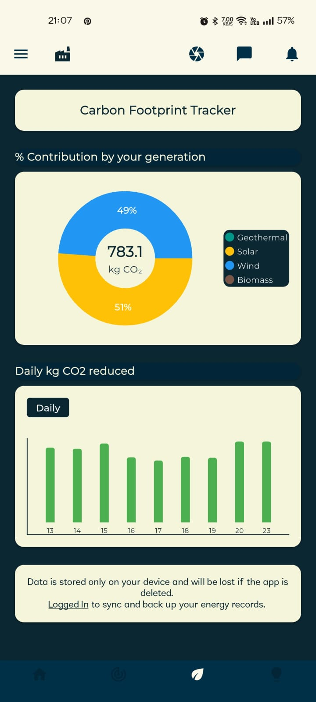
  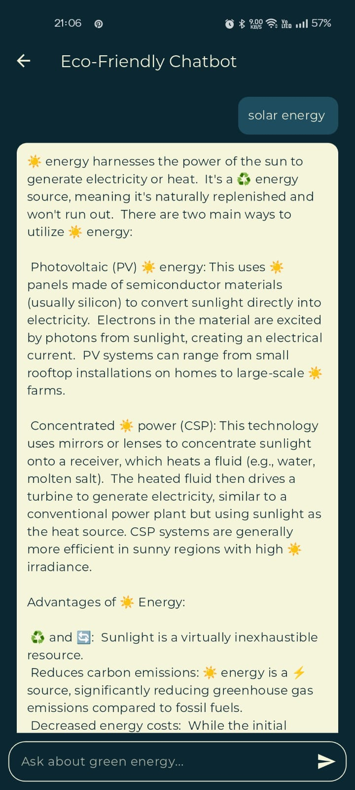
  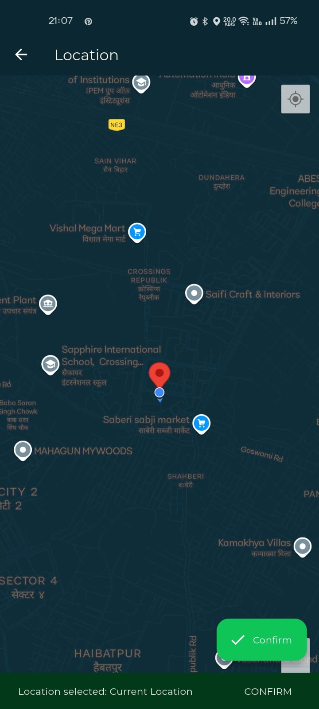
</p>

<p float="left">
  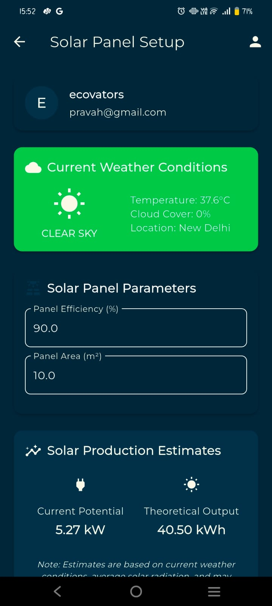
  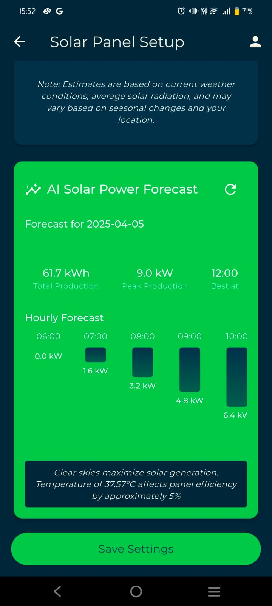
  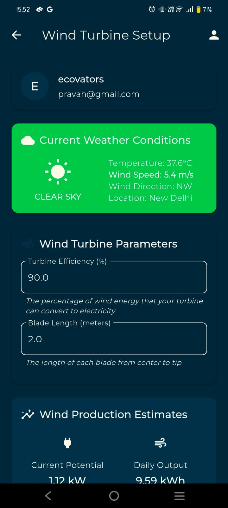
  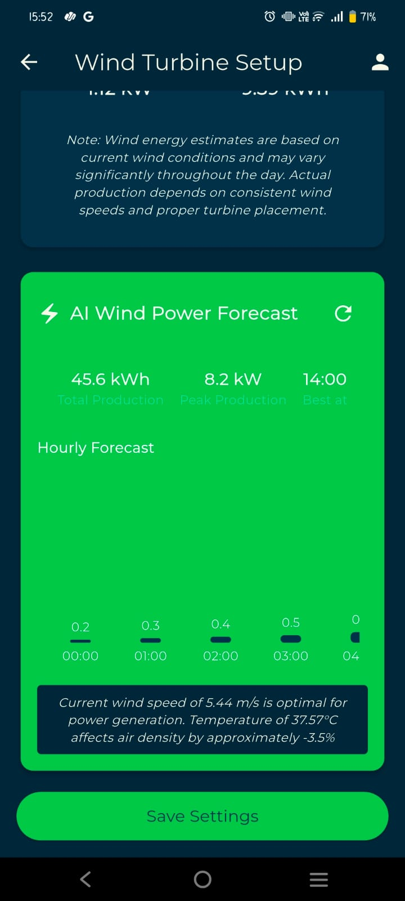
</p>

<p float="left">
  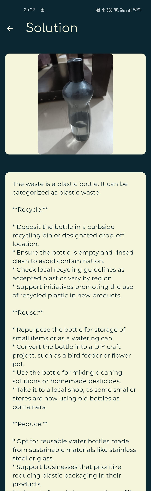
  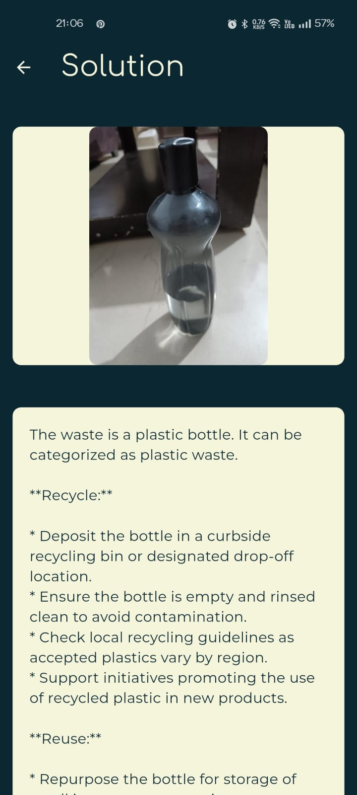
  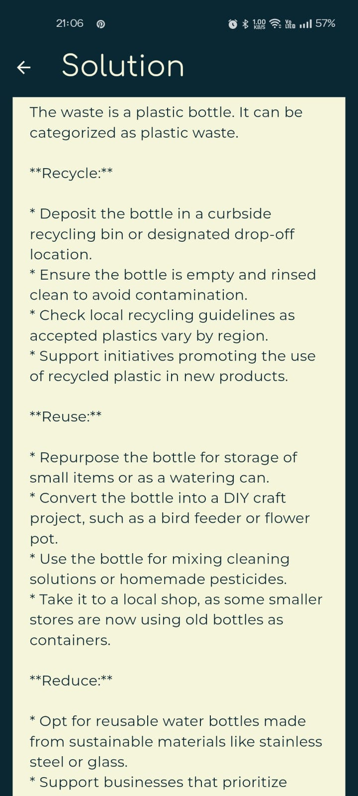
  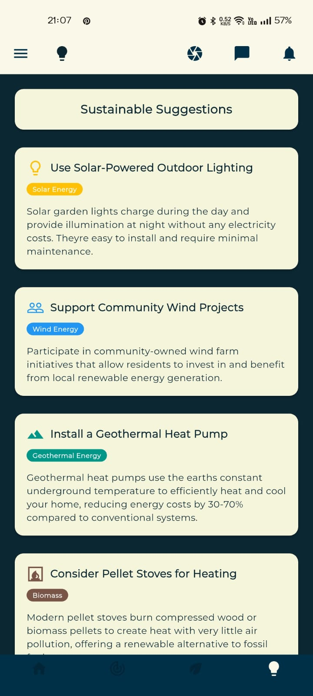
</p>

<p float="left">
  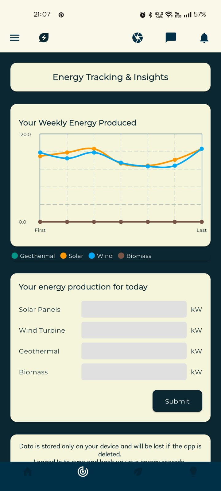
  
</p>

## Installation

### Requirements

- Compatible with Android, iOS, Windows, and macOS
- Flutter SDK ^3.6.1
- API keys for Gemini AI and weather services

#### Installation Methods

### Direct Installation

[Add download badge/link when available]

### Manual Installation

1. Clone the repository:

   ```bash
   git clone https://github.com/007divyanshu/pravah.git
   ```

2. Navigate to project directory:

   ```bash
   cd pravah
   ```

3. Create .env file with required keys:

   ```env
   FIREBASE_API_KEY=your_key
   GEMINI_API_KEY=your_key
   OPENWEATHER_API_KEY=your_key
   ```

4. Install dependencies:

   ```bash
   flutter pub get
   ```

5. Run the app:
   ```bash
   flutter run
   ```

## App Demo Video

[Add YouTube badge/link when available]

## Important Notes

- API keys are removed for security reasons
- Requires proper setup of Firebase project and Gemini AI access
- Internet connection required for AI features and real-time data
- Currently optimized for Android platforms.
